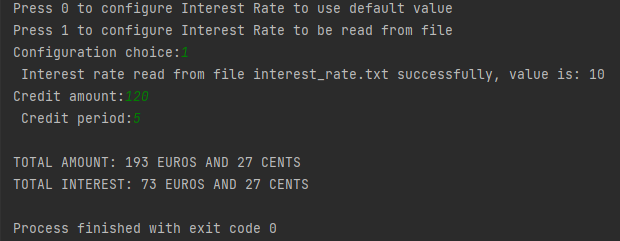
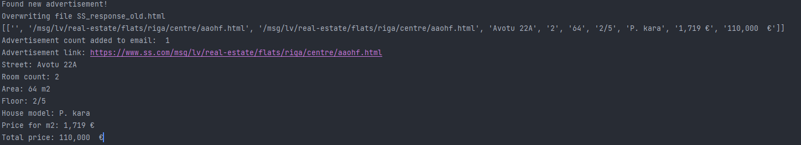

# Projects that I make for fun

Self built random projects for educational purposes and to have fun :)

## List of contents:

[Simple credit calculator (C/C++ project)](#credit_calculator)

[Simple real-time chatroom (Python project)](#simple_realtime_chatroom)

[ss.com advertisement scraper (Python project)](#sscom_advertisement_scraper)

[Hackerrank Python courses for certificate completion (Python tasks - basic)](#hackerrank_python_basic)

# [Simple credit calculator (C/C++ project)](https://github.com/DaButter/experimentalProjects/tree/main/SScom_advertisement_scraper) 
Simple credit interest calculator. Project written in C/C++, mainly used for excercise all kind of random and unusable user input handling.
Demo in terminal of this program:

# [Simple real-time chatroom for multiple users (Python project)](https://github.com/DaButter/experimentalProjects/tree/main/simple_realtime_chatroom) 
Simple chatroom which is hosted by the computer, which runs the program. This project uses python's flask framework to create a _socketio_ websocket to handle multiple connections and JS to update messages for all users in real time.

# [ss.com advertisement scraper (Python project)](https://github.com/DaButter/experimentalProjects/tree/main/SScom_advertisement_scraper) 
In my how country we use an advertisement service ss.com which sells flats, houses, cars etc. In this project I made an advertisement data scraper, which saves html response from a page and reads all the advertisements. Next time when program is launched, it compares the newly gotten html data and returns newly added advertisements. This program uses ss.com POST and GET services to use custom designed filter (price, area of flat, floor etc.).

# [Hackerrank Python courses for certificate completion (Python tasks - basic)](https://github.com/DaButter/experimentalProjects/tree/main/hackerrank_python_basic) <a name="hackerrank_python_basic">
Training and completing hackerrank.com Pyhon(basic) course development tasks for future certification. Work in progress
